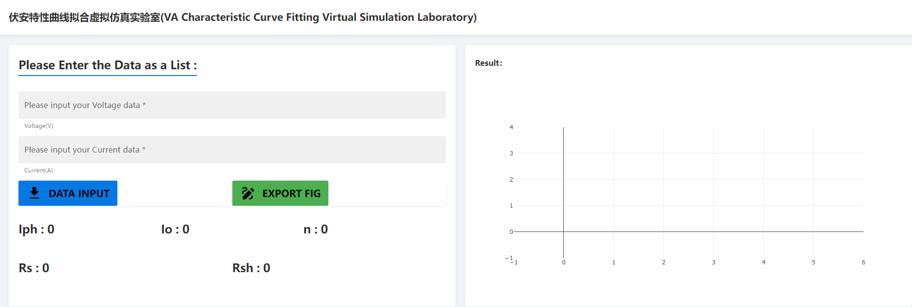

# PVLab

!!! tip
    Designed By: HY

    Email:

    [云实验室网页链接](https://ai4energy-pvlab.herokuapp.com/)。PS: 首次进入需要等待较长时间，Heroku上的App需要重启。

    如有错误，请批评指正。欢迎讨论交流。

## 设计原理

* 太阳能电池的工作电路可以看作是把稳定的电流源和单向导通的二极管并联时的等效电路。

* 单二极管模型需要确定五个模型参数：光电流Iph、串联电阻Rs、并联电阻Rsh以及两个二极管参数(饱和电流I0和理想系数n)。
* 导入测得的实验数据：
  1. 太阳能电池在不同工况下的电压
  2. 不同电压下对应的电流

## 交互要素

* text1：以列表的形式输入电压数据
* text2：以列表的形式输入电流数据
* button1：将电压电流数据传入后端
* button2：单二极管模型参数拟合
* plot：生成普通曲线图

## 操作说明

导入实验数据后，先点击“DATA INPUT”，再点击“EXPORT FIG”

## 实验演示

