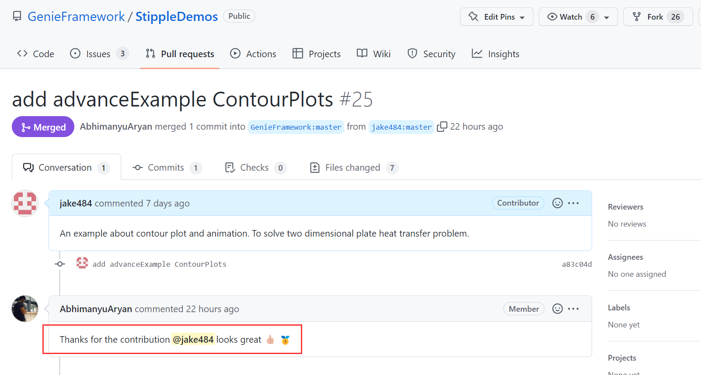

# App开发规范与建议

## 开发环境

!!! warning
    开发环境可以建立在`tests/`或其他文件夹中。尝试`labs/`中例子也不要对里面的项目直接修改。最好把它复制出来，`tests/`或其他文件夹中。规避无法撤回的风险。

1. 建立Julia环境的方法是创建`Project.toml`文件
2. 把Julia环境切换到当前文件夹，即

    ```julia
    TestLab> julia #进入Julia
    julia> #按下 ] 键进入包模式
    (@v1.x) pkg> activate .
    ```

    **或者按照[Quick Start中的方法2](./quickstart.md#方法2)，直接通过VScode运行也可以。**
3. 若要添加依赖包，使用`add`，那么在`Project.toml`文件中自动生成`[deps]`。所以这个文件中的`[deps]`，不用自己写。
4. `instantiate`实际上就是根据`Project.toml`的内容把相应的包拉取到当前环境。`Manifest.toml`是在实例化环境时生成的。[Quick Start中的方法2](./quickstart.md#方法2)把上述过程写在了Julia脚本中，自动完成。

    ```julia
    (TestLab) pkg> instantiate
    ```

需要自己写的是`[compat]`，这是**兼容**的意思。就是说明你的环境用的包版本是多少，为了避免因为包版本更新而产生错误。在包模式下输入`status`可以查看包版本。在本地App设计调试完成以后，把版本兼容手动写上去即可。

!!! note
    更多信息可以查看[Pkg.jl](https://pkgdocs.julialang.org/v1/compatibility/)

## App文件结构

文件结构做如下统一：

```powershell
XXX/
TestLab/
├── lib/
│   └── MyApp.jl
├── public/
│   └── favicon.ico
├── Dockerfile
├── Project.toml
└── run.jl
```

XXX为项目文件名，如`TestLab`与`HeatLab`。

这样的结构能够通过Docker直接部署。

## 文件内容

这部分主要看各位的理解程度，如果把Stipple实属玩明白了，随意发挥。

如果不太明白，仅修改部分内容也能够很好地实现App。

### 快速上手版

**仅修改**`lib/MyApp.jl`中函数`ui`与结构体`MyPage`**里面**的内容，这二者名字也不改动。

其他计算函数如`compute_data`、`pd`等按需修改。

### 高端精通版

唯一的要求：能用Docker部署。🤣🤣🤣

!!! warning
    `MyApp.jl`中使用了`MyApp`模块中的`MyPage`结构体与`ui`函数。模块化封装的作用是为了可以重定义`MyPage`。这是为了适配`Revise.jl`，目的就是为了实时同步代码更新。即网页运行时，直接修改代码，浏览器刷新一下就能看到代码刷新后页面的效果。但是如果修改了`MyPage`结构体，这个时候大概率还是得先`down()`再重新启动一下，这和页面渲染有关。如果碰到了问题，解决不了。就用那个经典的方法——重开Julia。🤣🤣🤣

    `run.jl`，`MyApp.jl`中的内容相关联，如果改动了`MyApp.jl`中的模块名和结构体名，需要做对应的关联，否则报错。

## StippleUI与StipplePlotly

这两个相关的内容是需要查阅文档的。

关于StippleUI。在例子里只用了滑杆(slider)与选择框(select)，还有很多有意思的UI组件在文档API中。大家可以自行查看。

关于StipplePlotly。画图时，支持各种图。Web画图主要是用PlotlyJS，StipplePlotly作为中间层，最终会把前面提到的`PlotData`的内容生成对应的CSS与JS文件。那么可以说，最终的目的是画PlotlyJS的图。所以有些API需要去[PlotlyJS的官方文档](https://plotly.com/julia/)找，例如HeatLab中`PlotData`里的

```julia
contours=Dict("start" => 0, "end" => 1000)
```

只有看官方文档才能写出来的。记住：`PlotData`是中间层，用来储存信息。`PlotlyJS`是最终目的。

## App介绍文档

Ai4ELab的文件结构为：

```powershell
Ai4ELab/
├── docs/
│   ├── src/
│   │   ├──labs/
│   │   │  ├──HeatLab.md
│   │   │  └──...
│   │   └── ...
│   └── ...
├── labs/
│   └── ...
├── .github
├── .gitignore
├── LICENSE
└── README.md
```

* 在`Ai4ELab/labs`中建立App代码文件夹
* 在`Ai4ELab/docs/src/labs`中建立自己的App介绍文档。文档模板参考`TestLab`与`HeatLab`。**把模板中的几大要点确定了，基本上App的框架设计也就完成了。**

## 调试建议与感悟

不会不要紧，若有解决问题的信心，没有解决不了的问题。

实践之路这样的：

1. 对照着页面看看代码
2. 有些理解了，根据理解做一些改动代码改动
3. 看看改动和效果和预期是否一致
4. 重复1-3，然后——小悟了！
5. 想象你期望的实现
6. 重复1-3，探索实现的方法
7. 在想象与现实之间多次挣扎，在Bug和撤回之间反复横跳
8. 在1-3的路上继续坚持，然后——大悟了！

实践理论再实践的马克思哲学原理不就用上了吗？👍

个人感悟，想清楚了这几个问题，就悟了：

1. 这一行代码（一段代码、一个函数、一个文件）完成了什么任务
2. 为什么要这么写，有没有什么道理（可能有也可能没有，如果能判断它为无关紧要的部分，那理解认识也就到位了）
3. 为什么他的可以跑，我的不行
4. 根据现有的机制，我想要实现我的想法的路径是什么

至此，App的教程到此就告一段落了。这些感悟与认识也是在写`TestPage`与`HeatLab`实践中得来的。在App设计与实践中依然会有很多没有遇到过的困难，这是必然的。站在巨人的肩膀上，再向前探索，解决一个又一个问题，也是一种乐趣。想象、实践到实现的创造过程，是人类特有的高级趣味，希望大家在实践中都能够有所体会。

此外，成为开发者很难吗？不难。

HeatLab已经并入了Stipple的高级示例库（AdvanceExample）。所以大家都能成为开发者。

  

日拱一卒，期望在Ai4ELab与StippleDemos看到大家的Pull Request。

**Whether amazing work or not, thanks for your contribution! Just do it!**

!!! tip
    有部署需要（汇报、展示、答辩等等）的同学，提前告知。App可以直接部署在组里的云服务器上。👍👍
