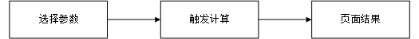
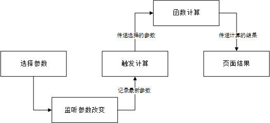
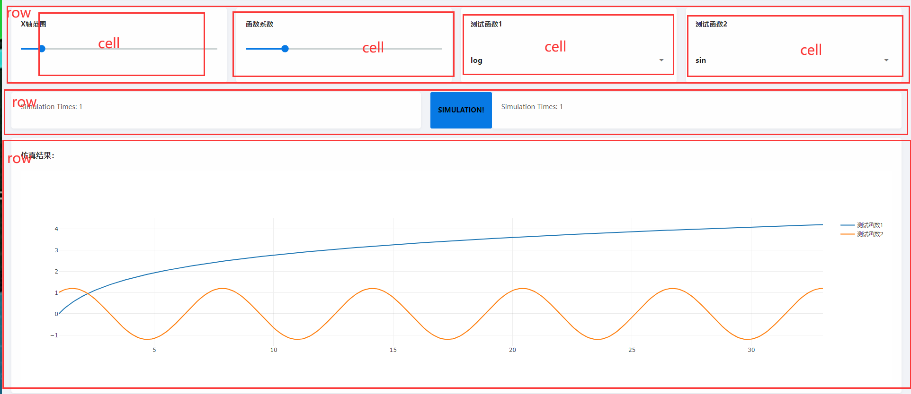

# App设计教程

在[Quick Start](./quickstart.md)之后，相信大家已经看到了Web页面，本篇依旧以`TestLab`为例，进行设计方法说明。

Stipple.jl用的是MVC框架，但是我们不涉及各种框架知识，有兴趣的同学自行查看。**我们从实践的角度贯通实现APP的思想**。

## 设计逻辑

整个程序的运行逻辑图如图：

  

在这个逻辑的基础上解决2个问题：

* 在交互页面选择参数，参数需要被程序监听（也就是说如果参数改变了，程序需要及时检测到）
* 被监听的参数传递到计算函数，函数计算出结果后页面展示结果。

所以，细分可以得到如下的逻辑图：

  

那么整体的程序设计思路就是紧紧围绕这个逻辑图来进行的。

## 代码剖析

### 参数“容器”

所有的可变参数都放置在——mutable struct（可变参数结构体）中。这个结构体叫`MyPage`（名字任意取）。

!!! tip
    可变参数本质就是被监听的变量。结构体中的成员实际上是变量，本篇中叫**参数**或叫**变量**都指的是同一个意思。

```julia
@reactive mutable struct MyPage <: ReactiveModel
    # iris_data::R{DataTable} = DataTable(data)

    value::R{Int} = 0
    click::R{Int} = 0

    features::R{Vector{Symbol}} = [:_sin, :cos, :log, :tanh]
    f_left::R{Symbol} = :sin
    f_right::R{Symbol} = :sin

    plot_data::R{Vector{PlotData}} = []
    layout::R{PlotLayout} = PlotLayout(plot_bgcolor="#fff")

    x_limit::R{Int} = 3
    paramenter::R{Float32} = 1.2
end
```

其中，用户决定的参数有：

* `x_limit` 对应 `X轴范围`
* `paramenter`对应 `函数系数`
* `f_left`对应 `测试函数1`
* `f_right`对应 `测试函数2`
* `value`、`click` 对应 `SIMULATION`按钮
  
储存计算的结果有：

* `plot_data` 对应 `动图`

### 生成页面函数——UI

```julia
function ui(model::MyPage)

    onany(model.value) do (_...)
        model.click[] += 1
        compute_data(model)
    end

    page(model, class="container", title="Ai4Lab",
        head_content=Genie.Assets.favicon_support(),
        prepend=style(
            """
            tr:nth-child(even) {
              background: #F8F8F8 !important;
            }

            .modebar {
              display: none!important;
            }

            .st-module {
              marign: 10px;
              background-color: #FFF;
              border-radius: 5px;
              box-shadow: 0px 4px 10px rgba(0, 0, 0, 0.04);
            }

            .stipple-core .st-module > h5,
            .stipple-core .st-module > h6 {
              border-bottom: 0px !important;
            }
            """
        ),
        [
            heading("测试")
            row([
                cell(
                    class="st-module",
                    [
                        h6("X轴范围")
                        slider(1:1:20,
                            @data(:x_limit);
                            label=true)
                    ]
                )
                cell(
                    class="st-module",
                    [
                        h6("函数系数")
                        slider(1:0.1:2,
                            @data(:paramenter);
                            label=true)
                    ]
                )
                cell(
                    class="st-module",
                    [
                        h6("测试函数1")
                        Stipple.select(:f_left; options=:features)
                    ]
                )
                cell(
                    class="st-module",
                    [
                        h6("测试函数2")
                        Stipple.select(:f_right; options=:features)
                    ]
                )])
            row([
                cell(
                    class="st-module",
                    p([
                        "Simulation Times: "
                        span(model.click, @text(:click))
                    ])
                )
                btn("Simulation!", color="primary", textcolor="black", @click("value += 1"), [
                    tooltip(contentclass="bg-indigo", contentstyle="font-size: 16px",
                        style="offset: 10px 10px", "点击按钮开始仿真!")])
                cell(
                    class="st-module",
                    p([
                        "Simulation Times: "
                        span(model.click, @text(:click))
                    ])
                )])
            row([
                cell(
                    class="st-module",
                    [
                        h5("仿真结果：")
                        plot(:plot_data, layout=:layout, config="{ displayLogo:false }")
                    ]
                )
            ])
        ]
    )
end

```

ui函数中有两个重要的部分：

* 触发——`onany`
* html页面——`page`

#### 触发

对于触发而言，`onany(model.value)`表示监听参数容器中`value`的值，如果这个值改变了，就进行系列计算。

!!! note
    思考：如果同时监听`x_limit`、`paramenter`、`f_left`、`f_right`、`value`会有什么结果。

#### page页面划分

对于页面而言，描述了整个html页面的结构。以及对应的参数绑定。
`page`中有`row`和`cell`，他们的关系如下：

  

整个页面分为3个`row`，每个`row`里面可以分出`cell`。

**可以向row与cell传递一些特性参数，例如size等，这些需要查阅官方文档的API。或者从代码示例中查看一些可能的用法，因为开发者本身的文档也不是很完善**。

#### page中值绑定

cell中，类似：

```julia
# 滑动条
slider(1:0.1:2,@data(:paramenter);label=true)
# 选择框
Stipple.select(:f_right; options=:features)
```

它们将页面与参数容器中的变量绑定在一起了。这种绑定中自动包含监听。也就是说用户只要拖动滑动条，那么它绑定的相应值就被记录下来了。

!!! warning
    记录不等于触发，只有`onany()`中的变量改变了才会触发。
    换一句话说，页面中绑定的值随时都在被监听，只要改变了都被记录下来。但是触发与否，哪些值触发，由`onany()`决定。
    即，监听是自动完成的，触发是人为决定的。

### 计算函数

```julia
pd(f, para, xlim, name) = PlotData(
    x=Float64[i for i in 1:0.1:xlim],
    y=Float64[para * f(i) for i in 1:0.1:xlim],
    plot=StipplePlotly.Charts.PLOT_TYPE_SCATTER,
    name=name,
)
function compute_data(ic_model::MyPage)
    f_left = isequal(ic_model.f_left[], nothing) ? sin : eval(ic_model.f_left[])
    f_right = isequal(ic_model.f_right[], nothing) ? sin : eval(ic_model.f_right[])
    xlim = ic_model.x_limit[]
    para = ic_model.paramenter[]
    for i in 0:30
        ic_model.plot_data[] = [pd(f_left, para, xlim + i, "测试函数1"), pd(f_right, para, xlim + i, "测试函数2")]
        sleep(1 / 30)
    end
    nothing
end
```

计算函数就干了一个活，触发以后，根据传回来的“用户决定的值”计算出相应的结果，并回传。那么就有两个问题：

1. 什么叫“根据传回来的参数”？
2. “回传”是怎么个“回传”法？

#### 结构体中可变参数调用

**第一个问题的本质是——调用**！因为前面已经说了。任何改变都会被监听并自动记录。被触发需要计算的时候，调用这些被记录的值不就可以了吗？事实上的确如此：

```julia
xlim = ic_model.x_limit[]
para = ic_model.paramenter[]
```

例如，这两个做法就是直接调用参数容器里的参数值

!!! warning
    参数容器里的参数值调用时需要带上`[]`，例如：`ic_model.x_limit[]`否则报错！

随后，调用了函数`pd()`。函数`pd`返回的是一个结构体，这个结构体叫`PlotData`。`PlotData`是非常重要的一个结构体。因为这是Web程序，画图不会直接画，而是需要把画图的数据存下来，生成相关的css和js文件，再在浏览器中显示。**所以需要`PlotData`这样一个中间体来存储画图的数据**。

!!! note
    对于Web程序来说，最终目的是展示结果。也可以说，生成这个`PlotData`是触发函数计算最终的目的。当然，也有存在其他的展示形式，如表格等等。本质上是一样的。

#### 参数回传

**第二个问题的本质是——赋值**！把计算出来的`PlotData`结果赋值给参数容器中的`plot_data`，实现传递。随后它就在与之绑定的页面区域中显示出来。也就是说，页面的监听是双向的。用户通过滑动条改变参数“容器”参数是可以的，后台计算程序改变参数“容器”参数也是可以的。无论哪一方改变了，都没有问题，页面都会做出相应的改变。

例如：

```julia
 for i in 0:30
     ic_model.plot_data[] = [pd(f_left, para, xlim + i, "测试函数1"), pd(f_right, para, xlim + i, "测试函数2")]
     sleep(1 / 30)
 end
```

这里通过for循环，连续得到30个`PlotData`并赋值给`plot_data[]`，只要赋值了，页面就会显示。此外，中间休息$\frac{1}{30}$秒。这不就是动画的原理吗？

!!! warning
    参数容器里的参数值被赋值时需要带上`[]`，例如：`ic_model.plot_data[]`否则报错！

## 总结

与逻辑图**不同**的是，程序的**框架**如下：

  

如果仔细思考可以发现，最关的键其实是我们的可变结构体：

```julia
@reactive mutable struct MyPage <: ReactiveModel
```

这个结构体是整个App交互的一个桥梁。交互时发生的变化，全部体现在这里面的参数（变量）的变化上。当需要设计一个App时，考虑交互的动态参数，其实就是在设计这个结构体的成员。

只要产生交互，就要设计变量放入“参数容器”中。

例如，本例中的两个滑杆，两个选择框，一个按钮。以及画图区域。这些是交互的组件，那么就要设计相应的变量来“承载交互”。

## 建议

本篇贯穿了App设计的理念。但对于一些细节不可能面面俱到。不太明白的话，对着代码看效果，努力思考为什么这么写能行。还有一些细节上的疑问，可以通过改动代码看页面的变化来琢磨它的机制。从实践中体会，这是理解最快的方式。同时积极参照官方文档及API。

从教程调试建议中看一看，学习方法。

可以多多思考，为什么这么写能行；如果要实现XXX，应该要怎么做；那么做能不能实现等等。

**发挥想象力，带着问题去探索实践，慢慢地，就悟了!**💪💪💪
